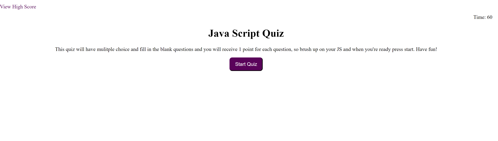

# Code-quiz

## Description
This project is a timed quiz about the fundamentals of Javascript. It is 6 questions long and it gives you 1 minute to complete. This quiz allows the user to click on a question and if it is the correct answer it will provide you with the next question but if you choose the incorrect answer it deducts 10 seconds off your timer. Ath the end of rth e quiz it will allow you to input your initials and save your score. I learned a lot about how to create elements dynamically using Javascript, starting a timer function, and how to go through an array of questions using a for loop. I had a lot of trouble with my highscore list using local storage and and the scores add on but in the end the hard work was worth it.

## Usage
To get started, you will press the start quiz button and it immediately starts the timer and the quiz questions follow. After you finish the quiz or if the timer timer ends before you do, you can save and view your score. You will then be given the option to restart the quiz if you'd like.

## MIT License

Copyright (c) [2021] [Kelly R. Cano]

Permission is hereby granted, free of charge, to any person obtaining a copy
of this software and associated documentation files (the "Software"), to deal
in the Software without restriction, including without limitation the rights
to use, copy, modify, merge, publish, distribute, sublicense, and/or sell
copies of the Software, and to permit persons to whom the Software is
furnished to do so, subject to the following conditions:

The above copyright notice and this permission notice shall be included in all
copies or substantial portions of the Software.

THE SOFTWARE IS PROVIDED "AS IS", WITHOUT WARRANTY OF ANY KIND, EXPRESS OR
IMPLIED, INCLUDING BUT NOT LIMITED TO THE WARRANTIES OF MERCHANTABILITY,
FITNESS FOR A PARTICULAR PURPOSE AND NONINFRINGEMENT. IN NO EVENT SHALL THE
AUTHORS OR COPYRIGHT HOLDERS BE LIABLE FOR ANY CLAIM, DAMAGES OR OTHER
LIABILITY, WHETHER IN AN ACTION OF CONTRACT, TORT OR OTHERWISE, ARISING FROM,
OUT OF OR IN CONNECTION WITH THE SOFTWARE OR THE USE OR OTHER DEALINGS IN THE
SOFTWARE.
